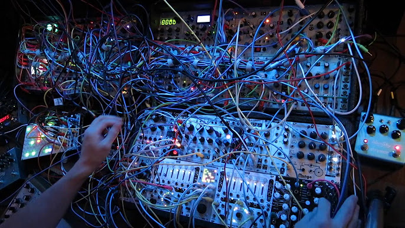

    <h1 align="center">Hi, I'm Matias </h1>
    
    <h4 align="center">Data Analyst (specialized in Python) from Argentina 🇦🇷 (living in Germany 🇩🇪 )</h4>

  
## About me

- 🌱 Currently deepening in Data Science
- :desktop_computer: I started programming 30 years ago and have knowledge in Python, C++, Java, Cobol, Delphi, Visual Basic, Pascal.
- :neckbeard: I have taught programming for more than 20 years</h3>

## Projects

|Data Analysis |     |Data Science
|---           |---  |---
<!-- |     |          | -->

## Lenguages and Tools

  &nbsp;
  &nbsp;
  &nbsp;
  &nbsp;
  &nbsp;
  &nbsp;
  &nbsp;
  &nbsp;
  &nbsp;
  
  <!-- &nbsp; -->
  <!-- &nbsp; -->
  <!-- &nbsp; -->
  <!-- &nbsp; -->

